# 🇵🇰 NADRA SOP AI Assistant
### Retrieval-Augmented Generation (RAG) Chatbot for NADRA SOPs

> **An AI-powered assistant that delivers accurate, source-grounded answers from NADRA Standard Operating Procedures (SOPs) using a modern Retrieval-Augmented Generation (RAG) pipeline.**


---

## 📌 Overview

NADRA’s Standard Operating Procedures (SOPs) are extensive and complex, making it difficult to quickly locate accurate information regarding:

- CNIC issuance & renewal  
- Family Registration Certificate (FRC)  
- Fees, timelines, and eligibility rules  

**NADRA SOP AI Assistant** allows users to ask questions in **natural language (English or Roman Urdu)**.  
The system retrieves the **exact relevant SOP sections** and generates **fact-based answers** using Google Gemini, ensuring **high accuracy and minimal hallucination**.

---

## 🎯 Key Objectives

- Provide instant answers grounded in official SOP documents  
- Eliminate manual searching through PDFs  
- Support bilingual queries (English & Roman Urdu)  
- Ensure accuracy through Retrieval-Augmented Generation (RAG)  

---

## 🧠 System Architecture (RAG Pipeline)

```mermaid
graph TD
    A[📂 NADRA SOP PDFs] -->|Load & Chunk| B[📄 Text Chunks]
    B -->|Generate Embeddings| C[📐 Vector Representations]
    C -->|Upsert| D[(🌲 Pinecone Vector DB)]

    U[👤 User Query] -->|Embed Query| E[📐 Query Vector]
    E -->|Similarity Search| D
    D -->|Top-K Retrieval| F[📝 Relevant Context]

    F -->|Context + Question| G[🧠 Google Gemini 1.5 Flash]
    G -->|Answer Generation| H[💬 Final Response]
```



---

## ✨ Features

- RAG-based Question Answering  
- Fast semantic search using Pinecone  
- Google Gemini 1.5 Flash for intelligent responses  
- Automated PDF ingestion pipeline  
- Interactive Streamlit UI  
- Cloud-ready & scalable architecture  

---

## 🛠️ Tech Stack

| Component | Technology | Description |
|---------|-----------|-------------|
| Programming Language | Python 3.10 | Core development |
| Framework | LlamaIndex | RAG orchestration |
| LLM | Google Gemini 1.5 Flash | Answer generation |
| Vector Database | Pinecone | Semantic search |
| Embeddings | HuggingFace (all-mpnet-base-v2) | 768-dim embeddings |
| Frontend | Streamlit | User interface |

---

## 🚀 Getting Started (Local Setup)

### 1️⃣ Clone the Repository
```bash
git clone https://github.com/kalim83266/nadra-sop-bot.git
cd nadra-sop-bot
```

### 2️⃣ Create Conda Environment
```bash
conda create -n nadra_rag python=3.10 -y
conda activate nadra_rag
```

### 3️⃣ Install Dependencies
```bash
pip install -r requirements.txt
```

### 4️⃣ Configure Environment Variables

Create a `.env` file in the root directory:

```ini
GOOGLE_API_KEY="your_google_api_key"
PINECONE_API_KEY="your_pinecone_api_key"
HF_TOKEN="your_huggingface_token"
```

> ⚠️ Never commit `.env` to GitHub

---

### 5️⃣ Ingest SOP Documents

Place NADRA SOP PDF files inside the `data/` folder and run:

```bash
python ingest.py
```

This step:
- Reads PDFs  
- Splits text into chunks  
- Generates embeddings  
- Uploads vectors to Pinecone  

> Run once unless documents change.

---

### 6️⃣ Launch the Application
```bash
streamlit run app.py
```

---

## 📂 Project Structure

```plaintext
nadra-sop-bot/
│
├── .env                  # API keys (private)
├── .gitignore            # Prevents secret leakage
├── requirements.txt      # Dependencies
├── ingest.py             # PDF ingestion & vectorization
├── app.py                # Streamlit chatbot
└── data/                 # NADRA SOP PDF files
```

---

## 🤝 Contributing

1. Fork the repository  
2. Create a feature branch  
3. Commit your changes  
4. Push to your branch  
5. Open a Pull Request  

---

## 📬 Contact

**Developer:** Kalim  
**GitHub:** https://github.com/kalim83266

---

## ⭐ Acknowledgements

- NADRA SOP Documentation  
- Google Gemini  
- LlamaIndex  
- Pinecone  
- HuggingFace  
